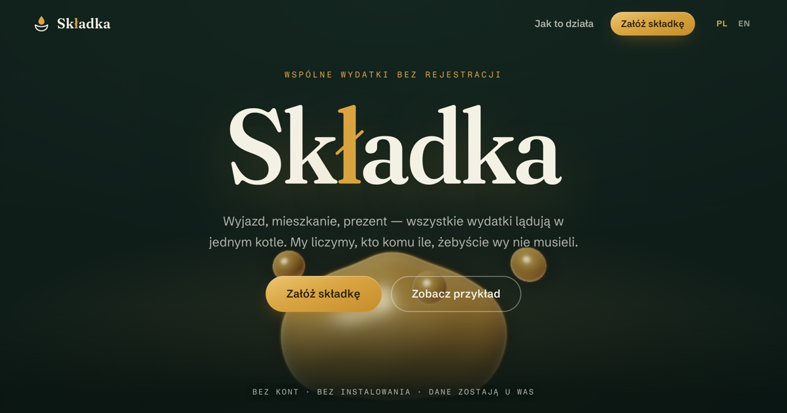

# Składka

**Wspólne wydatki bez rejestracji.** Wyjazd, mieszkanie, prezent — wszystkie wydatki lądują w jednym kotle. Składka liczy, kto komu ile, żebyście wy nie musieli.

**Group expenses, no sign-up.** Every expense lands in one shared pot; Składka does the who-owes-whom.

**Live:** https://antypasat.github.io/skladka/

## What it does

- Create a pot, add people, toss in expenses — no accounts, nothing installed
- Splits: even, weighted, or exact amounts — always grosz-exact (integer minor units, largest-remainder rounding)
- **Multi-currency expenses** — settle in one currency (PLN/EUR/USD/GBP/CZK/CHF) while paying in any of them; each expense carries its own FX rate, frozen at entry so shared links settle identically everywhere. One click fetches the ECB reference rate **for the expense date** (weekends fall back to the last fix), or type your own — the public API only ever sees a currency code and a date
- **Per-person timeline** — filter the receipt by any participant: what they paid, their share of every expense, and their running balance, day by day
- Minimal settlement: at most *n − 1* transfers via greedy max-debtor → max-creditor matching
- **Serverless sharing** — the entire pot is deflate-compressed into the URL fragment (`CompressionStream`), so a link *is* the data; old links keep working (versioned format)
- Polish & English, category auto-detection, per-day receipt grouping, undo, print-friendly settlement

## How it's built

- Zero dependencies, zero build step: vanilla ES modules, hand-written CSS
- The hero is a **raymarched liquid-gold metaball field** in raw WebGL 1 — every participant you type falls in as a droplet and merges with the pot; scrolling drains it
- Fraunces (WONK axis) · Schibsted Grotesk · Fragment Mono, self-hosted with `latin-ext`
- Money math is fuzz-tested (`node tests/money.test.mjs`): balances always sum to zero, settlements always zero out
- Respects `prefers-reduced-motion`, keyboard-first forms, WebGL-less fallback

## Credit

Designed and built entirely by **Claude (Fable)** — concept, brand, palette, shader, typography, copy, and code — as a demonstration of what the model can do end-to-end. Inspired by the category of no-login expense splitters (e.g. Kittysplit), redesigned from scratch.

License: MIT
